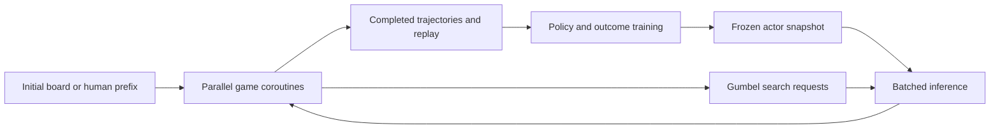

**Current defaults and maintenance update — 2026-09-13.** CUDA self-play now selects the whole compiled neural decoder automatically in generation, evaluation and the iteration runner. CPU probes select eager execution; `--decoder-mode current` is the explicit eager fallback. The redundant production `--reference-decoder` switch and failed regional `--compile-one-query` experiment were removed. Benchmark/profiler flags still support the useful reference and SDPA ablations; their explicit comparison defaults are preserved. Older commands/results below describe the versions used at measurement time.

The SDPA experiment used `torch.nn.functional.scaled_dot_product_attention`, dispatched to **memory-efficient attention** (`aten::_efficient_attention_forward`, `fmha_cutlassF_f32_aligned_64x64_rf_sm80` in the saved CUDA trace), rather than FlashAttention or the math fallback. The adopted compiled decoder uses the existing batched matrix-multiply/softmax implementation inside one compiled graph. Full compilation reduced the matched collection time from a median 274.28 to 222.89 seconds, about 18.7% less elapsed time / 23.1% higher throughput. This is whole-collection elapsed time, not a claim that every individual move has exactly that latency reduction.

Cached immutable packed root prefixes were enabled in **all final modes**, including compiled-only. The SDPA-specific single-allocation prefix/branch workspace was tested both eager and compiled. Its incremental compiled gain was only 1.85% with substantial variation. Prefix caching is useful existing work already included in the baseline; these measurements cannot assign its isolated contribution. SDPA avoids repeated full-prefix copies while the root-owner cohort stays fixed, but every attention call still reads prefix K/V, and changing the cohort repacks it. Persistent actual-game-root caching is a separate, deferred optimization.

Test cleanup replaces circular expectations with direct python-chess outcomes, shares dependency-light hard-exit semantics, keeps a fixed native parity corpus, and removes historical scheduling hashes and duplicated recipe constants. The fast CPU suite passed **2,280 tests in 20.35 seconds**, with 17 extended cases deselected and two warnings. The full-forward/cached/grouped/optimized decoder chain remains; compiler/device and broad random cases are explicitly run with `pytest -m extended` (or `-m ''` for everything). Explicit extended CPU checks passed four cases (13 skips), the decoder CUDA suite passed 23 (two skips), and native bindings passed 107. See the maintenance audit for scope and evidence.

---

**Whole neural decoder / reusable SDPA comparison — completed 2026-09-12.** Compiling the full neural decoder improves median completed training-position throughput by **23.1%** over the current eager implementation in matched final trials. Adopted as an explicit `--decoder-mode compiled` option in generation, the iteration runner and evaluation; existing defaults remain `current`. SDPA remains available only through benchmark/profiler mode selection because its incremental gain did not pass the 10% acceptance gate. Training remains stopped; this campaign did not update weights or run new Stockfish matches. These are throughput and correctness results, not evidence of learning.

**Final complete-collection comparison.** RTX 3070 Ti Laptop GPU, ckpt34, identical prepared prefixes and RNG, 24 concurrent games, 128 simulations, 16 candidates, depth 32, four Torch CPU threads, FP32 with TF32 disabled. Each trial completed the same 32 games (slot refill included): 2,775 searched/completed positions, **2,767 training-eligible positions**, 338,353 neural evaluations, 355,200 simulations, 27 mates, four repetition draws and one insufficient-material draw. No unfinished games, errors or depth cutoffs. Timings include collection and replay publication, with synchronized boundaries; model loading is separate. Profiling and tests did not run alongside these final throughput trials.

| Decoder | Trial seconds | Median eligible positions/hour | Peak allocated VRAM |
|---|---:|---:|---:|
| Current eager | 272.55 / 276.00 | 36,319 | 0.966 GB |
| **Whole neural decoder compiled** | **226.64 / 219.13** | **44,705** | **0.966 GB** |
| Shared-buffer SDPA | 269.48 (one trial) | 36,965 | 1.113 GB |
| Compiled + shared-buffer SDPA | 234.46 / 205.07 | 45,530 | 1.113 GB |

Rates above are medians of per-trial rates. Compilation alone passes the 10% throughput acceptance rule. Compiled-SDPA adds only 1.85% over compiled-only and varies substantially across repeats; that is insufficient evidence to adopt the added runtime path. Eager SDPA's single final trial provides no repeated acceptance evidence. Allocator peaks exclude CUDA context and reserved memory. Compiler disk caches had been warmed by earlier experiments, so first trials are not fresh-cache cold-start measurements. The initial 48-root compiled probe took 18.28 seconds on its first invocation and 3.00 / 2.55 seconds subsequently; this is a separate workload. No eight-hour compiled soak or 5090 measurement was performed.

**Implementation.** [The tensor entrypoint](../src/imba_chess/model/tensor_decoder.py) includes board/position embeddings, all eight HSTU blocks, final normalization and policy/value heads. `torch.compile(fullgraph=True, dynamic=True)` covers this entire neural computation. Host cache validation, branch preparation and chess search remain outside the graph. The wrapper references the existing model, preserving checkpoint keys and observing later weight updates. Collection records two graphs (batch size >=2 and singleton), zero graph breaks, and no continuing recompilation as history lengths change. Stage-1 forward/training is unchanged. Non-current decoder modes reject search depth above 32 at startup.

The SDPA workspace belongs to one executor/model and is reused while the ordered root-owner cohort stays fixed. Roots are packed directly into storage with 32 reserved suffix slots plus one leaf slot; packed prefixes are views into the same allocation. No duplicate prefix representation or per-query full-prefix copy is needed. Branch suffixes are updated each query, and the compiled graph writes the new leaf slot. Returned K/V are independent of mutable workspace storage. Changing the ordered cohort rebuilds storage: this is not a paged or persistent per-game-slot allocator. Padding/masks remain necessary for unequal history lengths. Traces confirm the FP32 memory-efficient SDPA backend; learned relative bias and full history semantics are preserved.

**Profile-driven corrections.** Initial 24-game prototypes measured eager 224.11 / 204.43 s, compiled 168.63 / 187.17 s, SDPA 208.41 / 207.35 s and compiled-SDPA 228.02 / 197.07 s. These predate the final wrapper and use fewer games. Packing roots directly into reserved storage eliminated duplicate packed-prefix allocations (SDPA peak fell from about 1.37 to 1.01 GB on that workload). Profiles then identified blocking input transfers: 1,206 stream synchronizations in 32 waves versus 950 in the original path. Nonblocking input copies on the existing stream reduced the final count to 886. Result readback still completes before search resumes. These changes are included in the final comparison above. Earlier campaign ratios below are historical measurements and must not be multiplied into this result across different workloads.

**Correctness and limitations.** The read-only replay auditor reconstructed **440 completed games / 38,586 searched positions** across campaign variants. Every played trajectory, terminal outcome and **root** visit vector matches its corresponding eager reference. This does not prove identical interior search decisions. Final compiled-only maximum policy-probability difference is **4.38e-5**. Final eager SDPA is about 4.87e-5. Compiled-SDPA has a larger **0.001105** difference at one position, reproduced across its initial and final implementations. At takeover ply 34 / continuation index 173 in game `2b464657e7bbabc198a75d0cbad1f6f7bd741090581cbd49e8e42ebe8a170338`, root priors/WDL and root visits are identical, but selected move `e2d2` has backed-up Q -0.01675239 versus -0.01574194 and target probability 0.03842356 versus 0.03952876. The root-only diagnostics cannot establish the cause; a changed interior selection from numerical perturbation is a hypothesis, not a verified explanation. No deeper tracing was performed because this mode also failed the incremental performance gate. The outlier is retained in `largest_sdpa_target_difference.json`; SDPA modes remain experimental.

Full CPU regression passed **2,335 tests**, with 13 skips and six existing warnings, in 106.12 s. Final CUDA checks after shared storage and asynchronous transfers passed **23 tests**, with two CPU compilation cases skipped. Tests cover branch depth 7 → 1 → 0 → 31, root replacement, one-game tails, immutable prefixes and returned K/V, reserved-prefix packing, workspace reuse, capacity rejection, and policy-weight updates between phases. The full CPU suite preceded the final nonblocking-transfer correction; the final CUDA suite exercised that correction. The final runtime/benchmark CLI checks passed four tests after restricting normal commands to current/compiled modes. Lint and whitespace checks passed.

**Reproduction and artifacts.** All results are under `artifacts/self_play_validation/decoder_campaign/`: `analysis.json`, `analysis-summary.json`, separate CPU/CUDA traces, compiler counters, recompilation logs, hardware/config/seed/checkpoint metadata and source snapshots (`source`, `shared-source`, `final-source`). `final_sweep.py` records exact per-variant commands in `command_*.txt`; its completed outputs are `collection_quiet_current`, `collection_async_compiled`, `collection_async_sdpa` and `collection_async_compiled-sdpa`. Earlier `followup_sweep.py` was stopped after one shared-storage trial to fix blocking transfers and superseded by the final sweep. Use fresh output paths when reproducing:

```bash
TORCHINDUCTOR_CACHE_DIR=/tmp/imba-decoder-inductor .venv/bin/python scripts/bench_self_play.py \
  --config config/self_play_laptop_fast.toml \
  --checkpoint artifacts/checkpoints_v4/best_hr10_checkpoint_34_hr10=0.9677.pt \
  --seeds artifacts/corpus/v4_self_play_seeds_128.json \
  --output artifacts/self_play_validation/decoder_compiled_repeat \
  --games 32 --repeats 1 --seconds 1200 --concurrency 24 \
  --simulations 128 --candidates 16 --threads 4 \
  --one-query-per-game --cache-prefixes --batch-projection --batch-inputs --batch-suffix \
  --decoder-mode compiled

TORCHINDUCTOR_CACHE_DIR=/tmp/imba-decoder-inductor .venv/bin/python -m pytest -q \
  tests/test_tensor_decoder.py tests/test_one_query_decode.py tests/test_batched_decode_results.py

.venv/bin/python artifacts/self_play_validation/decoder_campaign/analyze.py
```

The benchmark also accepts `current`, `tensor`, `sdpa` and `compiled-sdpa` for controlled comparisons. All GPU experiment queues have finished. The cancelled overnight learning job remains paused.

---

**Collection speed campaign — 2026-09-12.** The user cancelled overnight learning and requested profiling, throughput improvements and evaluations. The supervisor, collector, monitor and TensorBoard were stopped; the 08:00 evaluation queue is cancelled. The original run remains resumable at actor 000002, 35 optimizer steps / 20,152 exposures, iteration 2 collection, with 25 completed games and eight unlabeled interrupted games from the partial collection. No learning ran during this campaign.

**Measured complete-game throughput on the RTX 3070 Ti Laptop GPU (8 GB).** Every trial below uses the same ckpt34 weights, 24 prepared human prefixes, FP32, 128 simulations / 16 candidates / depth 32, four PyTorch CPU threads, and the same run seed. Each produced exactly 24 completed games, 2,129 searched positions, 2,121 training-eligible positions, 259,531 neural evaluations, 20 checkmates and four repetition draws. There were no unfinished games or depth cutoffs. Rates include prefix preparation, full root rebuilding, search, replay publication and the late-game tail; model loading is recorded separately. The first trial of a concurrency setting may reuse kernels warmed by an earlier setting in the same process; it is not a fresh-device cold-start measurement.

| Runtime | Concurrent games | Trial seconds (first / repeat) | Eligible positions/hour (first / repeat) | Peak allocated VRAM |
|---|---:|---:|---:|---:|
| Original decoder/controller | 8 | 868.56 / 959.90 | 8,791 / 7,955 | 0.47 GB |
| Batched attention, cached packing, batched inputs/readback | 8 | 266.54 / 256.45 | 28,647 / 29,774 | 0.57 GB |
| Same optimized runtime | 24 | 217.62 / 217.25 | 35,088 / 35,146 | 0.85 GB |
| Plus padding suffixes across all layers | 24 | 186.78 / 188.68 | 40,880 / 40,467 | 0.85 GB |

The final eager configuration improves median throughput approximately **4.6× even against the faster original trial**. Original trial variation was about 10%; the final pair varied about 1%. This is a fixed-prefix local comparison, not a 5090 forecast or an overnight learning result. The larger production soak and compilation comparison are recorded separately below.

**Adopted implementation.** CUDA `load_runtime` defaults to one-query batched attention, shared per-wave relative-position indices/masks, cached immutable prefix packing, batched input construction and compact legal-policy/value readback, and layer-batched suffix padding. One outstanding neural leaf per game and sequential backup are unchanged. The cache tracks evaluator ownership/order with weak references and is explicitly released at collection end. The controller caches invariant priors and running action means and avoids repeatedly summing visits inside action selection. Existing stage-1 model forward/training behavior is retained. CPU execution retains the reference defaults. `--reference-decoder` on generation, evaluation and the runner restores original decoder execution; individual benchmark flags permit ablations. Each new trajectory records its inference options.

The [new laptop configuration](../config/self_play_laptop_fast.toml) uses 24 concurrent games. Existing run TOMLs and their resume identifiers are preserved. Learning microbatch size, LR, search budget and target definitions are unchanged. The 96-root concurrency sweep measured warmed medians of 8.89 / 6.67 / 6.09 / 5.78 / 5.66 seconds at G=12/24/32/48/64; returns diminish above 24 and only 24 currently has repeated complete-game evidence. Long-history searches (164–293 root tokens) passed through G=32 at about 2.0 GB peak allocated memory. Layer tests additionally cover near-context-limit padding/masks. This does not establish worst-case G=64 memory near the positional limit.

**Profile evidence and correctness.** The original short CPU/CUDA trace issued 25,444 kernel launches for 16 decode waves; batching reduced this to 5,236 before the last padding improvement. Profiled host time fell from 552.9 ms to 142.1 ms. These traces are diagnostic, separate from unprofiled throughput trials. A subsequent 30-second profile identified suffix padding as a remaining hotspot (about five seconds), motivating the final change. Full root executor host time is approximately 2.5–3% of completed collection time, so persistent actual-game root caching is not justified by the 10% trigger. In unprofiled complete trials, all work outside the root/decode executors is around 10–12% of wall time; the measured opportunity favored batching PyTorch preparation over a new native tree boundary. Existing native board encoding and legal projection are reused.

All six eager optimized complete trials (144 games / 12,774 positions) pass full replay reconstruction and match every reference move, root visit vector, simulation count and terminal outcome. Fixed-root and long-history comparisons also preserve chosen moves/visits; floating policy differences are bounded by 4.44e-5 in the complete games and 1.76e-5 on the late-position probes. These are amplified search-policy differences from small FP32 decoder rounding changes, not altered search budgets or sampled-noise targets. Device tests verify mixed history lengths, suffix masks, cache ownership, batched result association, and exact layer-stacked tensor packing.

Validation: `.venv/bin/python -m pytest -q` passed **2,330 tests**, with seven GPU cases skipped inside the sandbox, in 95.97 seconds. Separate host CUDA runs passed the ten initial attention/result tests and six later result/suffix tests. The final runtime-option change passed its focused checks; `ruff check` and `git diff --check` passed. Logs, source snapshots, raw trial metrics, traces, metadata (checkpoint/config/seed hashes, git state, CUDA/device/CPU settings), and the read-only trajectory auditor are under `artifacts/self_play_validation/speed_campaign/`. The original checkpoint SHA256 is `5844b09fdde268f5fd2aba363603c43e9c1020d776c2d5294a17c2f912962826`.

**Production soak and final profile.** The normal `generate_self_play.py` entrypoint with `config/self_play_laptop_fast.toml` completed **64/64 games** (57 checkmates, five repetition draws, two insufficient-material draws), **5,597 continuation positions / 5,278 training positions**, in **521.48 seconds (8.69 minutes)**. Throughput was **36,437 training positions/hour**, **442 completed games/hour**, and 1,303 neural evaluations/second. There were no unfinished games, errors or depth cutoffs. All 64 trajectories pass reconstruction; the first 24 exactly match the reference moves despite slot refill. Every saved trajectory confirms all five optimizations, FP32, and compilation disabled. This broader seed set is a production confirmation, not a same-workload speed ratio or an eight-hour soak.

Twenty-one read-only process-memory samples during the soak peaked at **2,880 MiB NVML GPU process memory** and **1.61 GB host RSS**, with host RSS stabilizing as games completed. NVML includes reserved/context memory and is distinct from the allocator peaks in the benchmark table. The final 128-simulation CPU profile reduced merge preparation from 7.46 seconds for 41,256 neural evaluations to 2.62 seconds for 48,384 evaluations in equal 30-second diagnostic windows; padding time fell from about five seconds to about two despite the extra work. The short 16-simulation trace only reaches root children, so it demonstrates the attention batching gain but does not exercise deeper suffix padding. Artifacts: `production_soak/`, `final_profile/`, `final_cuda_trace/`, and `analysis.json`. All experiment/evaluation processes finished; the cancelled overnight training job remains stopped.

**Earlier regional-compilation decision (superseded by the whole-decoder comparison above).** Regional `torch.compile` of one-query attention preserved fixed-root moves/visits, but its complete 24-game trials took 216.58 / 212.97 seconds, versus 217.62 / 217.25 seconds for the corresponding eager implementation without layer-batched suffixes. This falls well below the 10% end-to-end acceptance threshold. The final layer-batched eager implementation is faster still (186.78 / 188.68 seconds). At this earlier milestone, regional attention compilation remained experimental; the subsequent whole-decoder implementation and measurements are documented at the top of this report. Artifacts: `search_compiled/` and `collection_compiled/`.

**Matched Stockfish check.** Both ckpt34 and the pre-existing trained actor 000002 completed 50 games from the same 25 held-out source-game prefixes with colors swapped. ckpt34 scored 5W/4D/41L; actor 000002 scored 4W/6D/40L. Both scored **14%** (individual paired-bootstrap 95% interval 7–22%). The paired difference was **0 percentage points**, with 95% interval **−6 to +6 points**. There is no demonstrated learning improvement or regression. This used **Stockfish 18, 40,000 nodes/move, one thread, 64 MB hash, UCI_LimitStrength=false**; the configured Elo field is inactive. It is therefore not comparable to the historical strength-limited SF2400 result. Artifacts: `stockfish_baseline/`, `stockfish_actor2/`, `stockfish_comparison.json` within the campaign directory. The main actor/best checkpoints were not changed by evaluation.

Reproduce the final eager complete-game comparison in a fresh output directory:

```bash
.venv/bin/python scripts/bench_self_play.py \
  --config config/self_play.toml \
  --checkpoint artifacts/checkpoints_v4/best_hr10_checkpoint_34_hr10=0.9677.pt \
  --seeds artifacts/corpus/v4_self_play_seeds_128.json \
  --output artifacts/self_play_validation/reproduce-fast-collector \
  --device cuda --games 24 --repeats 1 --seconds 900 --threads 4 \
  --concurrency 24 --simulations 128 --candidates 16 \
  --one-query-per-game --cache-prefixes --batch-projection --batch-inputs --batch-suffix
```

For the reference benchmark, omit the five optimization flags and use `--concurrency 8`. Exact arguments for every campaign trial are also retained in each output's `metadata.json`. No external nightly schedule was enabled.

**CUDA access correction.** The local GPU is an **RTX 3070 Ti Laptop GPU with 8 GB VRAM**. Sandboxed `nvidia-smi` and PyTorch checks failed, but the same checks outside the sandbox succeeded, including a real CUDA tensor computation. A host-access ckpt34 search check then completed eight concurrent roots at 128 simulations / 16 candidates / depth limit 32, twice without errors: 1,024 simulations and 915 neural evaluations per trial, in 2.820 seconds cold and 2.370 seconds warm. This is a search integration check, not completed-game throughput or a strength result. Artifacts: `artifacts/self_play_validation/ckpt34_cuda_access_check/{metadata.json,components.json}`. Local GPU validation is therefore available; only the remote 5090 remains unreachable.

**Laptop pilot checks — 2026-09-12.** Production search settings (128 simulations, 16 candidates, depth 32, eight concurrent games) ran for 178.858 seconds on CUDA: 452 searched positions, 56,198 neural evaluations, six completed games (four checkmates, two repetition draws), 155 completed positions and **147 training-eligible positions**. Eight active games were interrupted at the deadline and remained unlabeled. The short-run rates were 9,098 searched positions/hour and 2,959 eligible positions/hour; the late-game tail and discarded work make these provisional, not steady-state forecasts. Artifact: `artifacts/self_play_validation/ckpt34_cuda_rollout_rate`.

A disposable ckpt34 GPU training check on those trajectories completed backward and StableAdamW updates with finite loss (5.47986) and gradient norm (8.58568 before clipping). The small batch contained 346 context tokens / 147 supervised positions; cold/warm times were 5.672/0.312 seconds, with peak allocated VRAM 807,947,264 bytes. This does not establish memory use at the full token limit or long-run stability. Predicted draw probability was approximately 6.85e-8 versus observed draw targets of 0.150, reinforcing the need to monitor value-head calibration. Artifact: `artifacts/self_play_validation/ckpt34_cuda_training_check`. The installed Stockfish 18 also completed a 40,000-node legal-move smoke check outside the sandbox.

The validated [two-hour laptop config](../config/self_play_laptop_pilot.toml) retains the 4,096-position collection threshold and original search/learning settings, stops new collection/training after 105 minutes, and has a 120-minute hard budget. A controlled pilot is ready to attempt; a full GPU collect/train/evaluate soak and strength improvement remain unverified. At the short-run eligible-position rate, the first collection threshold takes roughly 83 minutes, so a one-hour run may produce no trained checkpoint. Stockfish comparison needs additional time and must compare ckpt34 and the new checkpoint on identical held-out prefixes and search/engine settings. The internal checkpoint evaluation may remain incomplete and is restartable. The user-authorized two-hour job launched at **2026-09-12 10:22 EDT (14:22 UTC)**, with an expected hard deadline near **12:22 EDT (16:22 UTC)**. PID `574206` was verified alive with GPU memory allocated; initial actor and `collect` phase state were published. Logs, launch metadata, replay and checkpoints are under `artifacts/self_play/laptop-pilot/`. Completion and learning results remain pending.

```bash
.venv/bin/python scripts/run_self_play.py \
  --config config/self_play_laptop_pilot.toml \
  --initialize artifacts/checkpoints_v4/best_hr10_checkpoint_34_hr10=0.9677.pt \
  --seeds artifacts/corpus/v4_self_play_seeds_4096.json \
  --output artifacts/self_play/laptop-pilot --device cuda
```

**Review fixes — 2026-09-12.** Two operational P1 findings are fixed. Evaluation now persists an explicit protocol failure for unfinished `game_limit` or `context_limit` results, raises `EvaluationProtocolError`, and refuses unchanged retries (including progress written by the previous version). The runner records `halted=true` with `halt_reason=evaluation_protocol`, preserves candidate and best artifacts, and makes no promotion/rollback strength claim from that failure. Standalone evaluation exits with an actionable message. Deadline/signal interruptions remain resumable, and capped games remain unlabeled.

External training and replay/training benchmarks now open `SelfPlayStore(..., read_only=True)`. This reads only the published manifest, performs no recovery, trimming, directory creation or manifest publication, and rejects add/flush/garbage collection/publication. Writer recovery remains unchanged under the existing orchestrator run lock. Readers are snapshots of published indexing state; they do not pin shards against later writer garbage collection, so long-lived external readers should use a retained copy if they need data beyond the writer's retention window.

Validation: `ruff check` passed on all eight changed source/test files; `git diff --check` passed. `.venv/bin/pytest -q tests/test_self_play.py tests/test_self_play_benchmarks.py tests/test_gumbel_search.py tests/test_batch_scheduler.py` passed **74 tests in 5.89 seconds**, including both capped-game reasons, old-progress rejection, interrupted evaluation recovery, runner halt at screen and confirmation, reader/writer interleaving without manifest mutation, and real benchmark read-only behavior. The existing laptop pilot remains on its original schedule; its process already loaded the older evaluation module. The fixed recovery path applies on next launch/resume and recognizes any capped results that process saves. No pilot replay or checkpoint was modified by this fix operation.

**Live laptop observation.** At approximately 11 minutes the pilot was still collecting with 16 published games, 887 published training positions, no updated actor yet, and no strength result. Those games comprised 11 checkmates, two repetition draws and three insufficient-material draws. Published counts exclude pending games until shard flush. A read-only [TensorBoard monitor](../scripts/monitor_self_play.py) now polls published state/manifest, tails complete JSONL metric records, and reads evaluation progress. It writes only its own TensorBoard events/logs and does not construct a replay writer or alter the running collector. Local `http://127.0.0.1:6006/` returned HTTP 200; event readback verified progress scalars. Monitor/server PIDs and commands are in `artifacts/self_play/laptop-pilot/monitoring.json`, bounded to approximately the original pilot deadline plus one minute. The pilot was not restarted.

Available charts: published games/positions and phase immediately; training loss, target KL, outcome CE/Brier, predicted/observed draws, gradient norm and reuse counters when training logs arrive; completed evaluation games and paired score/interval only when evaluation publishes them. Collection summary/latency rates are emitted at phase end by the existing runner, not every poll. `policy_entropy` currently measures search-target entropy, not the learned model's entropy. Training metrics use sampled replay, not a held-out validation loss. Improvement remains a matched, fixed-opponent strength question; self-play win/draw mix or decreasing replay loss alone cannot establish it.

**Completed laptop pilot.** The process stopped cleanly around 12:09 EDT, after the 105-minute collection/training launch cutoff and before the two-hour hard deadline. It completed one collect/train/evaluate iteration plus the next collection phase: **127 completed self-play games, 10,834 continuation positions, 9,992 training-eligible positions**, with no unfinished self-play games in the two collection summaries. Training phase zero made **18 optimizer updates / 10,160 supervised-position exposures** from 5,080 fresh training positions. Its summed optimizer-step timings were 13.717 seconds; collection phases took 1,829.462 and 1,752.225 seconds, delivering approximately 9,996 and 10,092 eligible positions/hour during collection. The provisional three-minute throughput estimate materially underestimated these longer completed-game phases.

The complete 100-game paired screen against ckpt34 produced **40 wins, 14 draws, 46 losses**, candidate score **47.0%**, paired-bootstrap 95% interval **39.5–54.5%**. This does not establish improvement or regression. The best checkpoint remains ckpt34; the valid trained actor is `actor-000001.pt`. No confirmation or Stockfish evaluation ran. Draw calibration remains poor: over the training batches, weighted predicted draw probability was 4.96e-8 versus 22.07% observed draw targets. This is a replay-training diagnostic, not a held-out post-training estimate.

The final `state-000001-train-000000018.pt` was read and verified: total steps 18, exposures 10,160, phase exposures 0, iteration 1 / phase train, pending exposure budget 9,824. The second phase has 4,912 newly collected training positions and is ready to resume; it made no optimizer updates before the time cutoff. Artifacts: `artifacts/self_play/laptop-pilot/{metrics.jsonl,screen-000000.json,state.json,run.log}`. Pilot, monitor and TensorBoard processes have exited; event logs remain on disk. No additional run was launched during this status check.

**Overnight continuation launched — 2026-09-12 17:12 EDT.** User authorized continued learning until **2026-09-13 08:00 EDT (12:00 UTC)**, followed automatically by evaluations. [The supervisor](../scripts/run_self_play_overnight.py) resumed the pilot's full optimizer/RNG/replay state with the same stage-2 config identifier. New operational CLI options set the absolute deadline, screen every third trained actor and defer 500-game promotion confirmation. Search, learning and replay settings remain unchanged. These scheduling overrides are recorded in `metrics.jsonl` and supervisor progress. The last 15 minutes stop launching collection, allow up to ten minutes of draining, and permit final training until one minute before the deadline. Existing regression/protocol-failure stops remain active. Default runner behavior remains unchanged when the options are omitted.

At 8 AM the supervisor snapshots the latest fully trained actor and ckpt34, then runs three sequential evaluations: candidate versus ckpt34, ckpt34 versus Stockfish, and candidate versus Stockfish. Each uses 50 identical held-out prefixes with colors swapped (100 games), original Gumbel settings, and a two-hour per-job cap. Incomplete jobs retain results for resume; they are not counted as completed evaluations. The paired comparisons and Stockfish jobs have separate output JSON/log files. Supervisor and child evaluation locks use separate directories; unit tests verify the handoff can acquire the evaluator lock. A failed training process records failure; it does not silently continue with an unexplained checkpoint.

Launch artifacts: `artifacts/self_play/laptop-pilot/overnight-2026-09-12/{launch.json,progress.json,training.log,overnight.log}`. Supervisor PID `657592`, GPU runner PID `657691`, monitor PID `657593`, TensorBoard wrapper PID `657594`. Runner startup recorded the deadline and cadence; GPU allocation was verified; `http://127.0.0.1:6006/` returned HTTP 200. TensorBoard uses a separate `overnight-2026-09-12` run label and watches morning evaluation files as well as training metrics. Monitoring/server stop around 14:05 EDT after the bounded evaluation window. Keep the laptop awake for wall-clock scheduling.

Validation: **76 targeted tests passed in 5.89 seconds**, including exact prior resume tests, cadence skipping, confirmation deferral, retained best checkpoint, queued morning jobs waiting until the absolute deadline, matching evaluation inputs, preserved checkpoint snapshots, and incomplete-job resume. Ruff and whitespace checks passed. No remote 5090 run was started.

```bash
.venv/bin/python scripts/run_self_play_overnight.py \
  --run artifacts/self_play/laptop-pilot \
  --config config/self_play_laptop_pilot.toml \
  --seeds artifacts/corpus/v4_self_play_seeds_4096.json \
  --output artifacts/self_play/laptop-pilot/overnight-2026-09-12 \
  --until 2026-09-13T08:00:00-04:00 \
  --stockfish /usr/bin/stockfish --eval-seconds 7200
```

**Replay-write diagnostic during the overnight run.** A read-only source snapshot supplied 16 completed games / 887 positions to three disposable stores in `/tmp`. Full store creation/add/flush (target validation, JSON encoding, Parquet compression, fsync and manifest publication) took 1.699, 0.458 and 0.487 seconds. Median 0.487 seconds. Source replay was never written. Artifact: `artifacts/self_play_validation/replay_write_diagnostic.json`. This supports deprioritizing replay-file writes compared with minutes of search per group of games; it is not an end-to-end CPU/GPU profile and does not isolate per-position target construction. The CUDA search integration artifact has empty service timing dictionaries, so root-prefill versus leaf inference versus CPU-controller percentages remain unmeasured.

**Implementation update — 2026-09-12.** The stage-2 prototype is now implemented. Training starts use human prefixes; initial-board starts are supported by the independent evaluation command only. Existing stage-1 behavior and the user's pre-existing working-tree edits are retained. The original design review follows this implementation record and should be read as historical rationale where it discusses proposed APIs.

| Milestone | Implemented and verified | Remaining gate |
|---|---|---|
| 1. Search reference | Torch-free Gumbel controller; explicit completed-Q constants; native history-aware terminals; exact budgets and sign backup; independently generated fixed-noise mctx fixtures | Larger GPU numerical checks |
| 2. Collector prototype | Same frozen actor for both colors; one outstanding leaf per game; completion-order delivery; token-bounded root batches; immutable replay; 32 ckpt34 continuations replay-audited | Audit at the production 128-simulation setting on GPU |
| 3. Benchmark | Explicit-input collector sweep; git/config/checkpoint/seed fingerprints; cold/warm trials; synchronized GPU boundaries; separate profiling mode; CPU diagnostic artifacts | GPU matrix, component attribution, and completed training positions/GPU-hour |
| 4. Learner | Sparse legal-policy CE plus actual outcome WDL; prefix masking; StableAdamW grouping shared with stage 1; full optimizer/scheduler/RNG/sampler resume; tiny overfit and three collect/train/evaluate iterations with restart | Several real-model iterations and monitored draw calibration |
| 5. Performance | Experimental batched one-query-per-game attention; CPU equivalence within existing decoder tolerances; disabled by default | Repeated end-to-end GPU acceptance (>=10% usable throughput or measured memory relief). Persistent root caches and Rust remain unimplemented, pending the prescribed GPU profiling sequence |
| 6. 5090 pilot | Dedicated local/5090 TOMLs and explicit-device commands | Local RTX 3070 Ti Laptop GPU (8 GB) accessible outside the sandbox; remote 5090 connection refused; one-hour soak and strength screen not run |
| 7. Nightly | Run-directory lock; atomic phase/checkpoint publication; bounded replay/checkpoint retention; graceful stopping and drain; hard eight-hour process watchdog; restartable color-swapped evaluation; independent best and rollback-stop state | Eight-hour GPU soak, complete strength evaluation, then external scheduling. No schedule was installed |

**Correctness evidence.** The repository-wide CPU run passed **2,311 tests** in 86.89 seconds (six existing warnings). The final focused search/collector/replay/trainer/benchmark/scheduler checks passed **78 tests** after the last failure-accounting change. The new tests include odd/tiny/excess-candidate budgets, fixed-noise final selection, reference completed Q, extreme logits, noise-free policy targets, terminal revisits, depth cutoffs, multi-ply sign alternation, repetition claims, outcome-before-limit ordering, complete-history target reconstruction, duplicate IDs, orphan-shard recovery, whole-game eviction, root token limits, completion-order slot refill, legal-policy loss by hand, finite gradients, tiny overfit, exact resumed parameters, paired evaluation gates, multiple runner iterations and resume, run locks, hard-budget process exit, deterministic interrupted-collection resume, and unlabeled per-game accounting after a merged-executor failure. Existing native terminal, castling/promotion/en-passant, cached decoding, and stage-1 tests remain in the full suite.

The independent search fixtures were generated by actually running mctx at revision `88f92056a420c2673bed282f5a0c00211f126e78`, with explicit root noise and solved one-step returns. See [the generator](../tests/fixtures/gumbel/generate_reference.py), [search fixtures](../tests/fixtures/gumbel/search.json), and [completed-Q fixtures](../tests/fixtures/gumbel/qtransform.json). JAX/mctx were installed only under `/tmp` for fixture generation; neither is a project runtime dependency. Attribution and the upstream Apache license are in [licenses](licenses/mctx-NOTICE.md).

**Real-model CPU diagnostic.** ckpt34, float32, four CPU threads, concurrency four, one simulation, one candidate, depth two, and 32 fixed human prefixes completed 32/32 games twice. Both trials produced exactly 1,893 continuation positions: 27 checkmates, one stalemate, four threefold claims. All stored moves, all-legal target IDs, target alignment, and final results were checked by reconstructing every trajectory. Of those positions, **1,826 are training positions and 67 belong to the monitoring split**. Cold/warm collection times were 86.862/85.764 seconds; warm p50/p95 search latency was 0.179/0.250 seconds; peak process RSS was about 1.55 GB. These are preliminary CPU diagnostics, not GPU acceptance measurements or learning evidence. The initial artifact's `usable_positions` includes monitoring positions; the current metric excludes monitoring and reports `completed_positions` separately. Root host timing was about 74 seconds versus about 10 seconds for leaf service. That identifies a CPU prefill cost; it does not establish the GPU bottleneck or justify adopting a cache optimization.

**Full ckpt34 gradient smoke.** A disposable CPU model initialized directly from ckpt34 completed one StableAdamW step over 441 context tokens / 247 supervised continuation positions, using a 512-token microbatch ceiling. Policy CE was 1.788815, WDL CE 0.090940, total loss 1.879755 and pre-clipping gradient norm 2.657382; all were finite. The step took 1.641 seconds. This verifies the real model's stage-2 backward/optimizer path, not learning: no actor checkpoint was published and no iteration threshold was bypassed in the production runner. Artifact: `artifacts/self_play_validation/ckpt34_gradient_smoke.json`.

**Final repeated diagnostic.** After making game RNG independent of scheduler concurrency and separating monitoring from training throughput, four trials again completed all 32 games with identical moves, policies and outcomes: 2,136 completed positions, **2,065 training positions**, 25 checkmates, three repetition draws, three stalemates and one insufficient-material draw. Warm collection times were 103.971, 108.079 and 106.145 seconds. Median usable throughput was **70,036.5 training positions/hour** (range 68,783.2–71,500.9); peak RSS was 1.550 GB. All four replay sets passed the complete trajectory audit. These are CPU-only one-simulation diagnostics, not the production 128-simulation baseline. See `artifacts/self_play_validation/ckpt34_cpu_repeated/summary.json` and `audit.json`. The explicit noise stream changed when its dependence on concurrency was removed, so the earlier 1,893-position diagnostic is not the identical workload.

Artifacts: `artifacts/self_play_validation/ckpt34_cpu/{metadata.json,s1-m1-g4-r0,s1-m1-g4-r1}`. A later `ckpt34_cpu_final` trial was interrupted to avoid overlapping the broad test suite; it is not a throughput result. The final repeated diagnostic uses `ckpt34_cpu_repeated`. Runtime optimizations remain disabled regardless of CPU microbenchmark results.

**Files and operational behavior.**

- [Search](../src/imba_chess/eval/gumbel_search.py) exposes `gumbel_stepwise`, `select_gumbel`, `GumbelConfig`, and compact `GumbelResult`. Values are side-to-move; edge means are parent-perspective. Terminal roots are rejected. Simulations and actual neural requests are counted separately. Search cancellation raises `InterruptedError`, which the game collector converts to an unlabeled unfinished trajectory.
- [Seeds](../src/imba_chess/self_play/seeds.py) select a takeover uniformly from eligible plies 20–120, exclude terminal/claimable positions, and split source IDs using SHA-256. Production iterations shuffle source games; fixed-size audits retain manifest order. Neither original outcomes nor human continuation moves enter the seed manifest. Corpus materialization now publishes a provenance sidecar.
- [Collector](../src/imba_chess/self_play/collector.py) checks terminal status before context/time/game limits. Full-root inference is the reference implementation. Every inference payload/result is associated with `(actor_id, game_id)`; per-search KV handles remain isolated. Context is guarded with `root_tokens + max_depth <= max_position_embeddings`. Games stopped administratively have no policy/value targets. Their counts and reasons are reported.
- [Replay](../src/imba_chess/data/self_play_store.py) writes immutable, compressed Parquet shards and atomically publishes a manifest after fsync/rename. Each Parquet row holds game ID, position count, and a JSON trajectory payload with prefix, continuation, sparse targets, outcome, actor/source IDs and diagnostics. This conservative payload representation is a prototype choice to benchmark before introducing more Arrow schema complexity. Pending rows are bounded by 16 games/2,048 positions; the active window evicts whole games. All-time ID metadata supports deduplication; inactive tensor/trajectory data is not retained in memory. Garbage collection keeps active data and data pinned by retained resumable checkpoints.
- [Dataset](../src/imba_chess/self_play/dataset.py) reconstructs inference's BOS/board/previous-move history, supervises only continuation boards, and verifies the actual terminal outcome. There is no terminal next-move target. [Loss](../src/imba_chess/self_play/losses.py) normalizes only legal logits and computes reductions in float32. Training uses `return_loss=False`, no Elo weighting and no moves-left loss. CUDA training uses the existing BlockMask path to avoid an oversized dense attention allocation at 8,192 tokens.
- [Trainer](../src/imba_chess/self_play/trainer.py) samples whole trajectories, counts supervised positions, and may slightly overshoot an exposure budget by a whole batch. It preserves the pretrained value head and updates the existing model. Checkpoints include optimizer, constant-LR scheduler, RNGs, shuffle queue, exposure counters, replay references, and iteration progress. Missing pinned replay or changed stage-2/base configuration makes resume fail explicitly. Metrics include policy CE/entropy/KL, WDL CE/Brier, predicted/observed draws, predicted value, gradient norm, exposure counts and training rates.
- [Runner](../scripts/run_self_play.py) alternates collection/training/evaluation; it never trains before the fresh training-position threshold. Interrupted collection restarts deterministic unfinished game IDs from their seeds and actor; already published completed games are skipped. Checkpoint publication precedes retiring obsolete files. The defaults stop new collection/training after 6h45m, allow a 15-minute collection drain, and reserve the remaining time for evaluation. A daemon watchdog exits with code 124 at eight hours if work has not returned; temporary files remain unpublished. A native call cannot be gracefully preempted, so the watchdog is the final bound.
- [Evaluation](../scripts/eval_self_play.py) persists individual game results and requires every planned color-swapped opening pair before computing the paired bootstrap interval. It keeps unfinished games unfinished and restarts them on identical-input resume. Best promotion needs the 250-pair confirmation's lower 95% bound above 50%. A 50-pair screen with upper bound below 45% records failure, rolls the published actor back, and halts the run. The Stockfish adapter uses 40,000 nodes, one thread, 64 MB hash, `UCI_LimitStrength=false`, and records its engine identity/settings. It clears engine state between positions for restart consistency; therefore new Gumbel Stockfish results must be labeled separately from the historical halving protocol.

**Commands.** Run from the repository root. The initial training seed corpus was successfully materialized and prepared:

```bash
.venv/bin/python scripts/materialize_corpus.py \
  --config config/imba_chess_v4.toml --split train \
  --output artifacts/corpus/v4_self_play_train_128.parquet \
  --max-rows 128 --chunk-rows 64
.venv/bin/python scripts/prepare_self_play_seeds.py \
  --corpus artifacts/corpus/v4_self_play_train_128.parquet \
  --output artifacts/corpus/v4_self_play_seeds_128.json
```

This produced 123 eligible prefixes, including 10 monitoring sources. The first larger download was rate-limited by Hugging Face (HTTP 429), but a retry succeeded. `artifacts/corpus/v4_self_play_train_4096.parquet` and `artifacts/corpus/v4_self_play_seeds_4096.json` now provide **4,030 eligible prefixes, including 392 distinct monitoring sources**. That satisfies the input requirement for both the 50-pair screen and 250-pair confirmation. The runner validates that requirement before loading the model. Both corpora use the v4 training month range/filters and provenance sidecars.

Prototype collection on a GPU host:

```bash
.venv/bin/python scripts/generate_self_play.py \
  --config config/self_play.toml \
  --checkpoint artifacts/checkpoints_v4/best_hr10_checkpoint_34_hr10=0.9677.pt \
  --seeds artifacts/corpus/v4_self_play_seeds_128.json \
  --output artifacts/self_play/prototype --games 32 --seconds 3600 --device cuda
```

Local benchmark matrix (use `config/self_play_5090.toml` and `--concurrency 8,16,32,64,128` on the 5090):

```bash
.venv/bin/python scripts/bench_self_play.py \
  --config config/self_play.toml \
  --checkpoint artifacts/checkpoints_v4/best_hr10_checkpoint_34_hr10=0.9677.pt \
  --seeds artifacts/corpus/v4_self_play_seeds_128.json \
  --output artifacts/self_play/bench-baseline --device cuda \
  --concurrency 1,4,8,16,32 --simulations 32,64,128,256 \
  --candidates 8,16 --games 32 --repeats 3 --seconds 3600
```

Use a fresh output directory for each benchmark. The script records a cold trial plus warmed repeats, median/min/max usable rates, search/actual inference counts, wave histograms, p50/p95 latency, terminal mix and peak memory. It stops increasing concurrency when throughput stops improving or peak allocation exceeds 85% of VRAM. Add `--one-query-per-game` only for the attention experiment and compare against the same baseline inputs; add `--profile` only in a separate diagnostic run. Large GPU measurements, root/leaf shape sweeps, replay I/O/reconstruction profiling, training throughput, and full-iteration timing remain to be collected; the primary script also exposes `--component controller|root|leaf|search|replay|training`. Controller mode covers budgets 1/2/3/16/32/64/128/256 and terminal-heavy roots. Root/leaf/search modes use the supplied real prefixes; prepare additional long-prefix manifests for near-limit experiments. Replay/training modes require `--replay DIR`; training accepts `--exposures N`. Component timings remain separate from collection throughput. Full-iteration phases are exercised by the bounded runner.

Standalone weight initialization and full-state resume are distinct:

```bash
.venv/bin/python scripts/train_self_play.py \
  --config config/self_play.toml \
  --initialize artifacts/checkpoints_v4/best_hr10_checkpoint_34_hr10=0.9677.pt \
  --replay artifacts/self_play/prototype/replay \
  --output artifacts/self_play/learner/state.pt --exposures 8192 --device cuda
# Replace --initialize with --resume artifacts/self_play/learner/state.pt
# to continue the same exposure budget and optimizer/sampler state.
```

Bounded pilot/nightly runner, using the prepared larger manifest, once GPU gates are ready:

```bash
.venv/bin/python scripts/run_self_play.py \
  --config config/self_play_5090.toml \
  --initialize artifacts/checkpoints_v4/best_hr10_checkpoint_34_hr10=0.9677.pt \
  --seeds artifacts/corpus/v4_self_play_seeds_4096.json \
  --output artifacts/self_play/nightly --device cuda
# Resume with the same inputs and --resume instead of --initialize CHECKPOINT.
```

Independent evaluation can use `scripts/eval_self_play.py --config ... --checkpoint ... --best ... --seeds ... --pairs 50 --output ...`. For the periodic Stockfish check, replace `--best` with `--stockfish /usr/bin/stockfish`; `--initial-board` replaces `--seeds` for initial-board evaluation. Do not compare its new Gumbel scores to historical halving figures as if search and engine-state handling were unchanged.

**No learning or end-to-end GPU throughput claim has been established.** The earlier CUDA-unavailable conclusion was a sandbox limitation, not a device limitation: outside the sandbox, PyTorch 2.14.0+cu130 detects the local RTX 3070 Ti Laptop GPU (8 GB), and an allocation/computation check passes. GPU commands must run with host device access. The configured `gpu_remote` SSH endpoint refused the read-only connection attempt; the one-hour/eight-hour soaks and real-model strength screens have not run, and external nightly scheduling remains disabled. The prototype and CPU verification are the delivered starting point for those measured gates.

---

**Stage-2 Gumbel AlphaZero trainer: design and readiness review — 2026-09-11.** The selected direction is to build Gumbel AlphaZero self-play directly around the existing exact chess environment and pretrained HSTU policy/value model. Support both initial-board starts and human-game prefixes followed by model-controlled play to completion. Existing halving remains an evaluation reference; implementing a halving self-play trainer first is not a prerequisite. A full EfficientZero V2 implementation is deferred.

Reviewed working tree: HEAD `9a9f32e` plus existing local edits, including retirement of alpha-beta/PVS. The original 2026-09-11 review changed documentation only; see the 2026-09-12 implementation record above. Timing figures below are explicitly historical; no GPU throughput benchmark was rerun. The session digests supplied context, while code, Git history, and experiment artifacts supply the evidence.

The report consolidates the experiment history, Gumbel mechanics, sequential game execution, cross-game batching, actor/learner lifecycle, implementation ownership, Rust boundaries, measured performance evidence, and the benchmark/acceptance plan. The design below incorporates the subsequent discussion; proposed components and settings are not implemented features or measured performance claims.

**The stage-2 loop we intend to build.** Stage 1 supplies ckpt34 and its existing chess knowledge. Stage 2 collects new decisions and outcomes, trains the same architecture, and uses updated weights for the next collection round. No separate White and Black networks are required.



| Role | Responsibility | Initial implementation |
|---|---|---|
| Actor | Select moves for both sides and generate search-policy targets | Fixed weights throughout one bounded collection phase |
| Learner | Optimize policy and value from replay | Runs after collection; explicit stage-2 optimizer and schedule |
| Evaluation opponent | Measure progress against previous weights or Stockfish | Separate frozen opponent when evaluating; unnecessary for ordinary self-play |

Actor and learner are logical roles. With alternating phases, one GPU model instance can serve both roles: inference mode during collection, training mode during optimization. Release search/game caches before changing weights. Training activations and optimizer state still consume memory; profile memory in both phases. Simultaneous actors and learning would require separate weight snapshots and resource scheduling, and is a later extension. This differs from maintaining one model for White and another for Black.

**One Gumbel search before one real move.**

The network supplies legal-move logits and a side-to-move value. At the root, sample a Gumbel perturbation per legal action and shortlist by `logit + gumbel`. Retain these perturbations throughout the root search. Sequential halving allocates visits to surviving candidates and ranks them using `gumbel + logit + sigma(completed_Q)`. Interior selection tracks the difference between an improved policy and current visitation frequencies; it does not reuse our halving frontier heap. [Reference root/interior selection](https://raw.githubusercontent.com/google-deepmind/mctx/main/mctx/_src/action_selection.py).

A simulation follows existing edges to a leaf, obtains a neural evaluation for a new nonterminal position, and updates search statistics along its path. Exact terminal results need no network call. Track visits and backed-up return estimates with a consistent player perspective. A simulation is not a whole game. [Reference search/backup implementation](https://raw.githubusercontent.com/google-deepmind/mctx/main/mctx/_src/search.py).

Search returns two outputs: an action to execute, and a training distribution over **all legal actions**. The latter is `softmax(teacher_logits + sigma(completed_Q))`; it excludes the exploration noise. Unvisited legal actions receive a baseline estimate rather than an automatic loss. The reference completion can combine the network's raw value with prior-weighted searched Q estimates, then scale values using visit statistics. Record the precise completion/scaling configuration with each actor version. [Value completion](https://raw.githubusercontent.com/google-deepmind/mctx/main/mctx/_src/qtransforms.py), [policy output](https://github.com/google-deepmind/mctx/blob/main/mctx/_src/policies.py).

For our adapter, legal masking applies at every exact-board node. Side-to-move values flip sign per ply during backup. Handle terminal rewards exactly once, so a terminal result is not both a reward and a second bootstrap value. Define simulation count, actual new neural evaluations, root evaluations, and depth limits separately: these are different quantities. Optional forcing-move floors or quiescence change the algorithm and should be separate ablations, not silently copied from legacy halving.

**Starting from human positions.** Sample a nonterminal position by replaying a prefix from the training corpus. Record the source game and takeover ply. The model then controls both colors until the new game ends. The human continuation and original result do not supply this continuation's targets.

For example, a human prefix of 40 plies followed by 60 generated plies has 40 context-only move steps and 60 model decisions with search targets. The takeover position itself is supervised. Attach the new result only to the takeover and continuation decision positions; earlier human actions do not become current-policy actions retrospectively. Separate human CE can remain an explicit auxiliary dataset, but is not implicitly applied to every prefix in a self-play batch.

Keep a configurable mixture of initial-board/short-opening starts, middlegames, and endgames, including balanced and advantaged positions. Mixture weights are experiment settings, not settled defaults. A later start can yield an outcome after fewer searched plies, but prefix prefill and long-context training still cost work. Repeating a seed position with different randomness gives multiple outcomes, at the expense of exploring fewer distinct seeds. Track this tradeoff and exclude held-out evaluation games from the seed pool. Related restart-state research supports studying this design without proving its effectiveness for this particular chess model. [Go-Exploit](https://arxiv.org/abs/2302.12359).

**How turns alternate and parallel games batch.** Each game owns one board, repetition history, sequence history, actor version, RNG stream, pending search, and trajectory. Both colors use the same weights and turn encoding. One shared real-game prefix cache per game is sufficient; hypothetical search branches have separate suffix caches.

```python
# Proposed control flow, not an existing runnable API.
board, history = replay_prefix(start)
trajectory = begin_trajectory(start, actor_version)

while not terminal(board):
    if context_or_length_limit_reached(board, history):
        return finish_as_truncated(trajectory)
    action, target, stats = yield from gumbel_search(board, history)
    trajectory.record(board.turn, action, target, stats)
    history.record_position_and_move(board, action)
    board.push(action)  # Changes the side to move.

return attach_new_outcome(trajectory, board.result())
```

After White's selected move is pushed, Black searches the resulting board. Black's actual response depends on White's actual move, so these two decisions cannot be simultaneous. Meanwhile other games are independent:

| Pending game | Request | Can share a batch? |
|---|---|---|
| A, White to move | New search-leaf evaluation | Yes, with other leaves using this actor version |
| B, Black to move | New search-leaf evaluation | Yes; color is an input, not a model identifier |
| C, different ply/history length | New search-leaf evaluation | Yes; grouped decoding preserves its own context |
| D, starting a new game | Prefix/root evaluation | Initially a separate request kind with its own token budget |

Use the existing `WorkRequest`/`EvalRequest` boundary and merged executors. Unlike the two-checkpoint match harness's `A:` and `B:` request keys, ordinary self-play should group by **actor version and work kind**, not White/Black. Multiple coroutines can share one process and one model; a coroutine is not a model copy or necessarily a CPU worker process.

Initially allow one pending simulation leaf per tree and batch across games. This preserves sequential selection/backup within each tree. More pending leaves per tree require explicit reservations/virtual statistics and reference tests; otherwise a batch can repeatedly select the same unexplored action. Refill completed game slots promptly and make trajectories available without the corpus-order holdback that exists for offline rollout reproducibility. Different games may advance at different rates.

For each move, root inference establishes the current policy and KV context; search extends it with hypothetical tokens. The actor server already persists actual-game KV across turns. The coroutine rollout path instead rebuilds the root from history. Either is a correctness baseline, but persistent **batched** game-root extension is a performance candidate for every-ply self-play. Subtree reuse across real moves is optional and deferred; do not confuse it with preserving the real-game prefix.

Increasing concurrency requires a **token-aware root batch limit**. `_merge_root_batches` concatenates prefixes and `_forward_model` uses dense attention, whose additive mask scales with the square of total tokens. Many long prefixes can exceed its existing 256 MiB mask guard despite each game being within its sequence limit. Chunk initial prefills by token/memory budget; do not equate a safe number of short games with a safe number of long games. Benchmark grouped incremental root steps separately from initial prefills.

The per-game context policy must also account for hypothetical search depth, not only real moves already played. The position embedding currently clamps out-of-range indices while the actor's persistent-root path has a length guard. Define the allowable root-plus-search context explicitly; do not let late-game search silently rely on repeated clamped position IDs.

**What a stage-2 replay example must contain.**

| Data | Purpose |
|---|---|
| Stable trajectory ID, source game/prefix, takeover ply, complete played moves | Reconstruct board state, exact draw history, and model context without storing every prefix repeatedly |
| Per-decision legal vocabulary IDs and target probabilities | Full legal search-policy supervision, including completed values for unvisited actions |
| Actual action, side to move, search counters/configuration, actor version and RNG provenance | Trace decisions and reproduce a collection configuration |
| New result, termination reason, completed/truncated status | Outcome labels without calling timeouts or length caps genuine draws |
| Collection iteration, learner progress, schema version and immutable shard manifest | Bounded replay, age tracking, recovery, and duplicate prevention |

The selected action can differ from the highest-probability training-target action because selection includes exploration. Keep both fields. If diagnostic Q/visit arrays are stored, label their meaning and legal-action alignment explicitly. Do not reuse legacy `RolloutRow` by populating `human_move_uci` with model moves; its human-game lookup assumptions do not describe these trajectories.

**Stage-2 loss and model lifecycle.** Retain the existing model architecture for the first implementation. Proposed baseline: legal-move soft policy CE plus side-to-move one-hot outcome WDL CE on completed continuations. White-win trajectories yield `[0,0,1]` for White decisions and `[1,0,0]` for Black decisions; draws yield `[0,1,0]`. Use explicit policy/value supervision masks. Context positions must remain visible to attention despite having zero direct loss weight; continuation gradients can still flow through their representations.

The current model uses `target_move_id != ignore_index` as a shared validity mask and applies hard move CE. Add a distinct stage-2 loss path so context masking, soft policy targets, and value validity are not accidentally coupled to an old hard target. Do not add hard CE on the sampled action by default: its exploration randomness is not the policy-distribution target. Handle padding without `0 * -inf` NaNs, and normalize by the intended supervised-position counts. Human Elo weights have no role in self-play examples.

Train by rebuilding sequences with current learner weights, not by loading actor KV as trainable features. Sample trajectories/positions under an explicit replay distribution; log both context tokens processed and supervised continuation tokens. Long human prefixes increase work per supervised token. If later training uses chunks, its history/burn-in and moves-left target semantics must be specified rather than silently resetting positions or treating a chunk boundary as game completion.

The baseline transitions the existing value head from engine-derived targets to self-play outcomes; measure calibration and draw learning explicitly. Keep any human policy or engine-value auxiliary objective as a separate ablation with separate metrics. Reuse the existing optimizer machinery, but initialize stage 2 from stage-1 **weights** with an intentional optimizer/schedule policy. The current `train.py --resume` restores optimizer and scheduler too; that is appropriate for resuming a stage-2 run, not automatically the desired stage transition.

Use bounded collect/train iterations first. Collect under one immutable actor version, finish or explicitly truncate active games, write completed shards, release caches, train for a controlled number of updates, then publish the next actor version. A future asynchronous runtime must pin versions per game and batch by version, or explicitly restart/recompute affected caches on refresh. Keep fixed evaluation checkpoints independent of collection refresh. No historical-opponent league or separate target network is required for the initial completed-outcome objective.

**What has actually been tried.**

| Experiment | Evidence and interpretation |
|---|---|
| Human policy imitation and outcome-based value learning | Historical foundation. Current training retains human move CE, but has replaced the outcome value objective. |
| Separate Stockfish-distilled value network | Trained historically, but the July review found it was never wired into shipped inference settings; subsequently removed. Its results do not establish the benefit of using it during search. |
| Search-backed value distillation, ExIt phase 1a | Frozen-checkpoint searches at sampled human positions; blended searched value with human game outcome. The July review reports worse held-out value loss as the blend increased and no adopted playing-strength gain. This is evidence against that recipe, not against all search-based value learning. |
| Search-backed policy distillation, phase 1b | Implemented an arm-restricted soft distribution, not just a one-hot search winner. Historical code constructs `softmax(detach(student_arm_logits) + sigma * stored_arm_q)` and adds its CE to human CE. User reports disappointing results; the reviewed artifacts do not establish a reliable numerical effect size for this phase. |
| Stockfish annotations in the shared value head | A documented success after target cleanup: ckpt27 scored 416/164/170 W/D/L over 750 SF2200 games, score 0.6640, versus the recorded ckpt23 anchor 0.6107. Useful incremental progress, not a solved improvement loop. |
| ckpt34 and halving parameter tuning | The current configuration uses budget 2048, top-m 16, own expansion 3, opponent replies 4, lambda .05, depth 8. The 750-game SF2400 confirmation scored 383/223/144, or 0.6593. Do not compare SF2200 and SF2400 scores directly. |
| Larger search budget | Budget 4096/replies 3 scored 0.6613 over 750 SF2400 games at 1.076 seconds mean model selection, versus 0.6593 and .552 seconds for budget 2048/replies 4. This comparison changes replies too; it supports choosing the cheaper configuration, not a clean claim that budget never helps. |
| Tactical coverage and bounded quiescence | Implemented and screened; both remain off in the selected configuration. Increasing branching under a fixed budget can reduce useful depth. |
| Alpha-beta and principal variation search (PVS) | Retired locally. Alpha-beta's interrupted 28-game screen reported 2/7/19; two-game smoke latency was 14.77 seconds/move. PVS's two draws took 19.37 seconds/move. Halving's 100-game screen took .577 seconds/move. Small smokes establish a latency problem, not PVS playing strength. |
| Complete self-play learning | No closed training loop found. There is already full model-versus-model game execution in `match_two_checkpoints.py`; it discards training search rows and does not learn from completed games. |

Evidence: [July experiment review](superpowers/notes/2026-07-12-value-tuning-and-exit-phase1a-review.md), [value-target handoff](VALUE_TARGET_WINPERCENT_HANDOFF.md), [alpha-beta/PVS handoff](CKPT34_ALPHA_BETA_PVS_HANDOFF.md), [ckpt27 result](../artifacts/eval/winpercent_ckpt27_sf2200_750.json), [ckpt34 2048 result](../artifacts/eval/ckpt34_overnight_20260905/confirm_r4_b2048_q0_750.json), [4096 result](../artifacts/eval/ckpt34_overnight_20260905/confirm_r3_b4096_q0_750.json). Phase 1b implementation is recoverable at `bb72576^`, in `hstu_model.py` and `data/policy_target_kl.py`.

The phase 1b implementation also truncated target arms to 24, potentially excluding forcing extras. Its conditional softmax did not supervise total probability assigned to searched versus unsearched actions. The old design's statement that non-arm probability stays unchanged is too strong: other logits receive no direct gradient from this conditional loss, but normalization and shared network updates can change their probabilities. Repeatedly tilting live logits against frozen Q estimates can amplify the same evidence as training proceeds. These are concrete differences from a refreshed teacher distribution and hypotheses worth testing; this review does not establish which caused the disappointing result.

**What exists today, and where the loop breaks.**

```text
Current training:
human games -> event sequences -> human move CE + annotated Stockfish value CE

Current rollout generation:
human game prefix -> search -> diagnostic label row -> play HUMAN move -> repeat

Proposed learning loop:
versioned actor -> search -> play selected move -> completed trajectory
       ^                                           |
       |                                           v
       +--- publish next snapshot <- learner <- bounded replay
```

The replay behavior is explicit in [`_process_game`](../scripts/generate_search_rollouts.py:362): the search result is recorded, then `play["move_uci"]` is pushed. Setting sampling to every ply changes label density, not the trajectory policy.

The reusable pieces are substantial:

- Exact native board transitions, move projection, encoding, terminal checks, and repetition history.
- A policy head, three-logit value head, board-square encoder, sequence trunk, prefix KV, and per-turn KV arena.
- Torch-free stepwise search yielding batches to a separate evaluator.
- Cross-game coroutine scheduling and an alternative multiprocessing actor/server runtime.
- Complete checkpoint-versus-checkpoint games, Stockfish evaluation, and substantial correctness tests.

The current [`EventBuilder`](../src/imba_chess/data/event_builder.py:24) only creates value targets from Stockfish annotations. Game outcomes are carried for reporting. Feeding ordinary self-play PGNs through it would produce **zero value supervision**, and the current policy objective would imitate played actions rather than consume search distributions. The generic masked soft value CE can already accept different targets; the producer and policy-loss plumbing must change. Search-target training hooks were deleted in `bb72576`, while generation/storage remained.

The existing value labels are `[1-p, 0, p]`. The draw logit is therefore not a learned draw probability. Search consumes `p(win)-p(loss)`; a self-play outcome objective would change its calibration and give the draw column meaning. Preserve the engine-supervised checkpoint as a control, and explicitly choose between transitioning this head to outcomes or adding a separate outcome head with an auxiliary engine-value loss. Do not silently mix incompatible target semantics.

**Search choices are separate from training choices.** Sequential halving is a search allocation procedure. ExIt is an expert/apprentice learning loop. AlphaZero combines an exact environment, search-derived policy targets, and outcome learning. These can share components; they are not mutually exclusive switches. [AlphaZero paper](https://arxiv.org/pdf/1712.01815), [Expert Iteration paper](https://arxiv.org/abs/1705.08439).

Our [`_halving_stepwise`](../src/imba_chess/eval/search.py:789) is value-based search: policy selects/prioritizes candidates, `_backed_stm` performs negamax over scored descendants, and root arms compete on `backed_value + lambda * log_prior`. Frontier expansion follows accumulated policy plausibility. `evals_spent` counts evaluated descendants; it is not a ready-made MCTS visit-distribution target. Depth 8 here can evaluate nine plies from the decision position because an arm root starts at depth zero.

Gumbel AlphaZero is especially relevant because it addresses policy improvement with limited search. Its retained Gumbel perturbations affect selection, and its target uses completed action values. The improvement result assumes adequate action-value estimates; it is not a guarantee that approximate chess search or a trained student becomes stronger. [Author-hosted paper](https://davidstarsilver.wordpress.com/wp-content/uploads/2025/04/gumbel-alphazero.pdf).

The existing implementation only retains the **ordering** from Gumbel sampling. It discards the perturbations before halving scores, uses partial minimax backups, and applies heuristic top-k interior expansion. A proper comparison therefore needs a distinct search controller, not just `budget=32`. DeepMind's reference separates root selection, interior selection, completed-Q transformation, and the returned training distribution. It supplies a useful behavioral reference; its JAX implementation is not a drop-in replacement for our PyTorch/native environment. [Reference policy code](https://github.com/google-deepmind/mctx/blob/main/mctx/_src/policies.py).

**What to borrow from EfficientZero V2.** The paper targets sample efficiency on Atari and control tasks, not chess throughput. It combines learned latent dynamics with search, policy/value training, temporal consistency, and replay reanalysis. Its search-based value estimation averages bootstrapped search trajectories using a current target model; that differs from our selected arm's minimax value. Reanalysis is additional work for us even if value estimation can reuse a policy reanalysis search. The continuous-action sampling extension is unnecessary for our finite legal-move set. [EfficientZero V2, sections 3–4 and Appendix H](https://arxiv.org/html/2403.00564v2).

My assessment: exact chess transitions are already available and cheap enough to retain. Borrowing replay refresh and studying alternative value backups is plausible after the first learning loop. Replacing those transitions with learned dynamics would add an accuracy problem before demonstrating a systems benefit. MuZero specifically requires a representation/dynamics/prediction system trained through recurrent unrolls; our cached transformer still consumes the actual successor board and is not such a dynamics model. [MuZero paper](https://arxiv.org/html/1911.08265v2).

| Route | Reuse | Required additions | Assessment |
|---|---|---|---|
| Iterated ExIt on human positions | Generator, halving, model, corpus | Fresh teacher snapshots, full legal policy targets, training join, controlled replay/relabel schedule | Smallest controlled learning experiment; distribution remains human-game positions. |
| Self-play with current halving | Above plus match loop | Played-action trajectories, exploration, replay, outcome targets, soft policy loss, actor refresh | Optional alternative. Existing halving remains a search/evaluation reference; no separate halving trainer is required. |
| Gumbel AlphaZero with exact boards | Environment, network, evaluator, batching | New root/interior selection and value statistics, completed-Q targets, small-budget validation | Selected stage-2 direction. |
| Conventional PUCT AlphaZero | Same environment/network | MCTS edge visit/value statistics, PUCT, policy target generation, leaf batching | Strong baseline; must avoid recreating serial one-leaf GPU calls. |
| Outcome-only actor-critic or TD/Q learning | Model and game execution | Behavior probabilities/advantages or TD targets, replay/target network as appropriate, opponent management; Q head for direct action values | Cheaper collection, but less search supervision and harder sparse-reward credit assignment. Separate experiment. |
| Smaller exact-board actor | Teacher, labels, rules, all evaluation | Distilled smaller policy/value model; optional short-history architecture | A potential structural throughput gain if larger batches/cheaper inference retain strength. Full board-only replacement needs retraining and draw-state care. |
| MuZero / full EfficientZero V2 | Broad training/evaluation scaffolding | Latent dynamics, reward prediction, recurrent training sequences/losses, latent search, model-error validation | Largest change. Consider only if a measured prototype justifies it. |

**Remaining hot paths: historical measurements versus current findings.**

The final August rollout profile in [the performance handoff](GENERATION_PERF_HANDOFF.md) reported roughly 34.3% search bookkeeping, 30.9% decode projection, 21.7% decode enqueue time, 10.9% preparation, and 2.1% root evaluation. These are old ckpt23 coroutine measurements. They do not describe today's larger ckpt34 actor runtime. The unsynchronized buckets also cannot partition CPU and GPU execution cleanly; the first CPU readback absorbs outstanding device work.

| Priority | Code evidence | Proposed work and practical limit |
|---|---|---|
| Actor tensor/readback work, if using that runtime | [`_gather_legal_logits`](../src/imba_chess/eval/actor_server.py:173) builds device ID tensors in a row loop and calls `.tolist()` on each device row after the gather. `_service_waves` repeats this per game. | Construct padded IDs once on CPU, transfer once, gather, transfer the compact result once, then split host lists. The coroutine evaluator already follows a more batched pattern. Concrete work reduction, **unmeasured speedup**; not a blocker to a coroutine collector. |
| Native tree boundary, after measuring Gumbel | [`_push_children`](../src/imba_chess/eval/search.py:641) still allocates Python nodes/handles, builds sets, marshals histories per child, and pushes Python heaps for legacy halving. | This identifies a type of overhead, not the correct Gumbel implementation. Port the new controller's nodes, legal edges, histories and visit/backup updates if material. Preserve batched `EvalRequest` behavior. Historical halving child-expansion share was about 25% of wall time: making it free would give only 1.33x. Do not port the old frontier heap as a prerequisite. |
| 3: Batch incremental roots | [`_service_roots`](../src/imba_chess/eval/actor_server.py:500) services incremental requests individually; `_service_incremental_root` decodes each new token sequentially and concatenates persistent KV. | Batch independent games at each extension step; consider capacity-managed game prefixes. Especially relevant when searching cheaply on every move. Do not infer its current share from sparse-label root timing. |
| 4: Scheduling and overlap | [`BatchScheduler`](../src/imba_chess/eval/batch_scheduler.py:64) executes synchronous ticks. Actors compute independently but server work still has launch/collect boundaries. | Measure queue wait, batch sizes and device idle time. Use ready-game microbatches and bounded in-flight work if justified; compare at equal CPU/GPU allocation. Changing arrival order can change numerical batching and trajectories. |
| 5: Remaining preparation/diagnostics | [`_merge_decode_requests`](../src/imba_chess/eval/merged_executors.py:151) repacks prefixes/suffixes each wave; chains remain Python lists. `_arm_search_stats` traverses every retained arm tree at search completion. | Profile with ckpt34 before optimizing. Diagnostic traversal is newer than the August profile. Avoid repeated tensor construction; collect counters incrementally if material. Native board encoding and forcing flags already exist. |
| 6: Long-running storage | Generator retains `all_rows` and rewrites the entire parquet at each flush. | Use bounded replay and immutable completed shards; this is a scaling requirement for an unbounded actor loop, not an established bottleneck in short runs. |

Already delivered: dense SDPA root inference, native move projection/terminal handling/board encoding, shared KV arena, grouped decode scratch, legal-only device gathering in the coroutine path, and local corpus materialization. Do not schedule these as missing work. Earlier measurements found no reliable end-to-end gain from several dispatch/transfer reductions, and rectangularizing grouped attention imposed substantial padding cost. Kernel count alone is not a speedup metric.

A useful current artifact check: the halving screen averaged **392.25 rows per decode call** over 30,095 calls. PVS produced 231,486 single-row calls and only six two-row calls. Alpha-beta likewise produced 223,214 single-row calls and nine two-row calls. Different active-game counts prevent a clean isolated comparison, but the batch starvation is directly observed. PVS had real cutoffs; it still paid an expensive neural call for almost every serial step. Merely moving that controller to Rust would not repair the GPU dependency pattern.

**Budget reduction requires a new quality test.** The historical halving budget study found best-move agreement with budget 2048 of 71.8% at 512, 62.2% at 128, and 55.1% at 32. This warns against silently substituting cheap labels. It does **not** prove that every disagreement is an inferior chess move: budget 2048 is a reference, not ground truth. Nor does it test another search algorithm's improvement per unit time.

Benchmark two contracts separately. For a pure runtime optimization, preserve positions, randomness, arm values, decisions, and evaluation counts. For an algorithm change, evaluate independent move quality, tactical failure rates, match strength, and subsequent student improvement at equal wall-clock cost. Search-policy improvement on its own value estimates is insufficient evidence.

Full games cost much more than sampled human replay. A 115-ply game searched at every move with budget 2048 can require about **235,520 evaluated nodes**, plus roots; a sampled human game with ten labels needs about 20,480. At an aspirational 250k searched positions/hour, budget 2048 requires about **142k node evaluations/second**, excluding overhead. These are arithmetic workloads, not throughput predictions. Report positions/hour, completed games/hour, unique replay positions/hour, and strength gained per GPU-hour; mean actor move latency is not aggregate throughput.

**Implementation map: existing versus new work.** Proposed new filenames below describe ownership, not files already present.

| Component / likely owner | Already present | Implement or improve for stage 2 |
|---|---|---|
| `src/imba_chess/eval/gumbel_search.py` (new) | `search.py` protocols, legal/value evaluations, native rules | Independent torch-free Gumbel controller and result type; visits/Q, root noise, interior selection, completed-Q policy; explicit budget and terminal accounting |
| `src/imba_chess/self_play/collector.py` (new) | [`match_two_checkpoints.py`](../scripts/match_two_checkpoints.py:118) plays complete games after replaying prefixes | Seed sampler, one shared actor for both sides, per-game coroutine, training trajectories, completion-order delivery |
| Inference runtime | [`position_evaluator.py`](../src/imba_chess/eval/position_evaluator.py), [`merged_executors.py`](../src/imba_chess/eval/merged_executors.py), [`batch_scheduler.py`](../src/imba_chess/eval/batch_scheduler.py) | Reuse coroutine runtime first for a reference; token-bounded roots, version-aware requests, slot refill, metrics; profile persistent root extension |
| Optional multiprocessing runtime | [`actor_worker.py`](../src/imba_chess/eval/actor_worker.py), [`actor_server.py`](../src/imba_chess/eval/actor_server.py) | Current workers play against Stockfish, not a ready-made self-play collector; adapt game/data protocol, batch actor readbacks and incremental roots if selected |
| `src/imba_chess/data/self_play_store.py` (new) | Existing atomic parquet writer and rollout diagnostics | Versioned trajectory schema, immutable shards, bounded replay, sampling, deduplication and recovery |
| `src/imba_chess/data/self_play_events.py` (new), collate/types | Existing event encoding and packed causal sequences | Prefix/continuation masks, legal soft-policy targets, completed outcomes, explicit truncation handling; no annotation requirement |
| Model/loss | [`hstu_model.py`](../src/imba_chess/model/hstu_model.py) policy/value heads and generic soft value CE | Stage-2 soft policy objective, independent masks/normalizers, source-specific auxiliary losses and metrics |
| `scripts/train_self_play.py` (new), stage-2 config | [`train.py`](../scripts/train.py) optimizer, scheduling, checkpoints | Extract reusable training helpers; collect/train coordinator, weight-only initialization, full stage-2 resume and replay manifest checkpointing |
| Evaluation and benchmarks | Existing Stockfish, direct-match and profiling scripts | Gumbel selector integration, fixed inputs and noise, paired openings, target/learning diagnostics, repaired profiler paths |

**Minimum implementation for a useful first loop.**

1. Reuse the model-versus-model game coroutine, retain search outputs, and play their selected actions. Use one shared actor model when both sides have the same snapshot, allowing their requests to batch together. Keep actor weights fixed for a defined collection iteration initially.
2. Store complete action history or enough replayable prefix context, legal action IDs, teacher policy target, action played, result, termination reason, model version, search configuration, and seed. Separate actual terminal outcomes from truncations. An isolated FEN is insufficient for this history-dependent model and repetition rules.
3. Add an explicit self-play event producer. Supply one-hot outcome targets in side-to-move `[loss, draw, win]` order, and a masked soft policy objective over legal moves. Distinguish context-only tokens from supervised tokens; the present value mask also depends on a valid move target. Decide whether the auxiliary moves-left loss is valid for each completed/truncated sequence.
4. Store the full legal policy target from the Gumbel actor snapshot. Do not recompute it by repeatedly tilting learner logits against stale Q, and do not invent MCTS visit targets from legacy `evals_spent`. Existing halving is sufficient as an evaluation reference without creating a halving training target.
5. Add bounded replay, a chosen human/self-play mix, and an explicit update-to-data ratio. A learner can consume generated data many times faster than actors create it; uncontrolled reuse is not fresh experience. Start with short collect/train iterations before adding simultaneous training and inference.
6. Publish each new actor snapshot at a safe boundary and discard/recompute its KV caches. Updating weights while retaining old per-game KV makes representations inconsistent. Stored training examples should contain reconstructible inputs, not old actor caches treated as current features.
7. Unify termination and context limits. The native search and Stockfish actor path consider claimable draws; the checkpoint match loop uses `claim_draw=False`. Choose one rule policy across search, play, and labels. At the model's context limit, truncate explicitly or implement a trained context strategy; do not convert every timeout or length cap into a true draw.
8. Evaluate fixed opponents and direct checkpoint matches using recorded openings with color reversal. Track value calibration, search-vs-policy gain, target entropy, draws/repetitions, replay age, and results at fixed search budget **and** fixed time. A lower human-move hit rate can accompany stronger self-play; it should not be the sole checkpoint selector.

The first outcome targets can use completed game returns with no bootstrapping. Later TD or search-value experiments must respect alternating player perspective; a next-state side-to-move value changes sign when backed up one ply. Reanalysis should refresh targets under a versioned current/target network while preserving the historical input context. It should remain a measured option rather than an automatic extra search on every sample.

**What should move to Rust, and what should stay in Python/PyTorch.** More Rust is not necessary to establish a correct first trainer. The native crate already owns board transitions, terminal/repetition logic, move projection/forcing flags, and board token encoding. Rewriting these again is not a missing feature.

For a first Gumbel controller, use compact integer node/edge IDs and parent links with the existing native boards; keep a small reference implementation that can be checked independently. If measured tree control is expensive, a coarse native boundary should own the new node/edge arena, board/history storage, traversal, visit/value updates, and legal move metadata. Return pending leaf IDs and packed inputs in batches, then consume a batch of policy/value results. Avoid one Python/Rust call per candidate move and avoid constructing a full `[node, 1970-action-vocabulary]` tree when only legal edges are needed.

The hypothetical boundary is `advance(searches) -> pending_leaves`, followed by `consume(leaf_ids, values, legal_priors) -> next_work_or_results`. GPU KV tensors and model execution remain in PyTorch; Python can retain mappings from stable native node IDs to evaluator handles. This is an interface sketch, not an ABI commitment. Parent-linked native histories or compact undo records avoid marshalling full repetition lists per child. Batch encoding/projecting can be added if their boundary costs remain material. Preserve numerical precision, stable legal ordering and deterministic tie-breaking in reference comparisons.

Keep replay, experiment coordination, losses, optimizers, and checkpointing in Python. A Rust tree cannot eliminate serial GPU dependencies or fix per-row tensor transfers by itself. Profile the **Gumbel** collector before committing to a native port; the old halving allocation/heap profile cannot predict the new controller's share.

**Recorded benchmark evidence, with its limits.** These results were produced earlier; this report update does not rerun them. They come from different stages and must not be multiplied together as an overall speedup.

| Measurement | Recorded result | Meaning for this design |
|---|---|---|
| Dense SDPA root change, old ckpt23 rollout workload | Root bucket 33.5s -> 1.0s; end-to-end 2.13x at budget 2048 | Already implemented; not a future gain |
| KV arena cutover, old 12-wave profile | Self CPU 1.407s -> 1.003s; self CUDA 297.4ms -> 239.0ms; peak allocated VRAM 6,340.9 -> 4,165.7 MiB | Existing arena reduces path-copy work and creates memory headroom; these are profile totals, not game throughput |
| Later dispatch/gather reductions, paired runs | 95.2s -> 94.5s and 94.70s -> 93.70s totals | No reliable wall-time improvement; fewer ops/transferred bytes are insufficient evidence |
| Final August 12-wave profile | Self CPU 1.209s; self CUDA 261.9ms | Host-side work remained substantial; this ratio is not a precise GPU-utilization measurement |
| Proposed rectangular grouped attention, sizing study | ~3.35x attention FLOP tax against a measured ~3.1% wall-time opportunity | Previously unattractive; do not revive without new shape evidence |
| ckpt34 halving, 750-game SF2400 run | 0.552s mean move selection; score 0.6593 | Useful latency/strength reference, not aggregate self-play positions/sec |
| ckpt34 alpha-beta/PVS smokes | 14.77s / 19.37s mean move selection; almost entirely single-row decode calls | Strong warning about serial inference; tiny gamesets do not settle playing strength |

Source for the optimization rows: [generation performance handoff](GENERATION_PERF_HANDOFF.md), especially the arena results and final decode-wave campaign. Its old references to “HEAD,” “current,” or “Stage 3” refer to that campaign, not this stage-2 trainer. Its older ckpt23 measurements also precede the larger ckpt34 model and some later native work.

The new collector has additional costs worth measuring: per-ply roots instead of sparse sampled roots, long human-prefix prefill, a potentially larger count of small game groups, complete-game storage, and training on context-only tokens. With one pending leaf per game, grouped attention can execute many small per-game operations. The old large-wave profile does not settle whether launch overhead or tree work dominates that shape.

**Benchmark plan before claiming fast self-play.**

| Benchmark | Workload | Measurements and decision |
|---|---|---|
| Fixed-root search | Saved training positions with complete prefixes; opening/middlegame/endgame strata; ckpt34 | Roots/sec, new leaf evaluations/sec, simulations/sec, p50/p95 latency, depth, terminal hits, target entropy and independent move-quality checks |
| Cross-game scaling | Proposed Gumbel budgets 64/128/256 and root candidates 8/16; begin with feasible concurrency and increase under a memory cap | Batch row/group-size histograms, requests/sec, queue wait, GPU timeline, peak memory; choose budget/candidates/concurrency jointly, not a blind full grid |
| Prefix and game-root inference | Representative short/long prefixes, cold initial prefill and subsequent one-ply extension | Prefill latency, total-token limit, full-root versus grouped-incremental cost and output agreement |
| CPU/native decomposition | Actual Gumbel collection, not synthetic opening-only boards | Selection, expansion, history handling, projection, encoding, backup, serialization; decide whether a native tree has enough share to justify work |
| Completed collection | Same seed distribution, actor snapshot, rules and resource budget | Completed trajectories/hour, supervised continuation positions/hour, average continuation length, truncation/failure rate, unique seeds and repeat count |
| Learner throughput | Replay with realistic human-prefix/continuation lengths | Supervised positions/sec, total tokens/sec, context fraction, peak training memory, replay reuse; tune updates per new position |
| Learning experiment | Equal total collection + training time, fixed evaluation openings/opponents | Strength of successive checkpoints, search versus raw-policy strength, value calibration/draw behavior, target/replay age; completed training loss alone is insufficient |

Count terminal simulations separately from neural evaluations and charge root inference explicitly. For a prefix-started game, charge only model-played continuation moves as searched decisions but include prefix preparation in total runtime. A nominal 2048-to-128 reduction is 16x fewer requested evaluations under comparable accounting, not a measured speedup or proof of adequate quality.

Warm up context creation, kernels and any compilation before steady-state measurement; record cold-start separately. Use CUDA events/synchronization for isolated timings and a CPU/CUDA trace for overlap. Also measure unprofiled wall time: instrumented timings can distort the workload, and summing overlapping CPU/device times is invalid. Interleave repeated A/B runs, report variation, fix CPU/GPU resources and desktop contention, and record checkpoint/vocab hashes, source diff, dtype, rules, search settings and seed manifests.

For a pure runtime optimization, fixed-position tests should preserve search work and targets under a defined numerical tolerance. For Gumbel versus halving, different targets are expected; evaluate chess quality and downstream learning rather than requiring agreement with halving. Full stochastic games can diverge after tiny numerical differences, so do not use trajectory identity as the sole runtime-equivalence test.

**Benchmark tooling that needs repair.**

| Existing script | Present limitation | Required action |
|---|---|---|
| [`profile_torch_waves.py`](../scripts/profile_torch_waves.py) | Hardcodes deleted ExIt config, old checkpoint and corpus | Accept explicit config/checkpoint/input/runtime; exercise the new collector after it exists |
| [`bench_decode_wave.py`](../scripts/bench_decode_wave.py) | Hardcodes deleted config/old checkpoint and runs legacy generation | Parameterize; treat it as a decode probe, not evidence of stage-2 throughput |
| [`probe_bookkeeping_phases.py`](../scripts/probe_bookkeeping_phases.py), [`probe_push_children.py`](../scripts/probe_push_children.py) | Old config/checkpoint and halving-specific function instrumentation | Retain for historical reproduction; create equivalent Gumbel selection/backup probes |
| [`bench_root_eval.py`](../scripts/bench_root_eval.py) | Stale default config/checkpoint, though CLI overrides exist | Supply current inputs and verify its measured attention path matches the selected runtime |
| [`eval_vs_stockfish.py`](../scripts/eval_vs_stockfish.py) | Existing selector/runtime integration lacks Gumbel | Add Gumbel dispatch and resolved settings; retain batch and move-latency diagnostics |

Do not present these scripts as ready-made commands for the new trainer. The new CLI and configuration are implementation work; none is introduced by this documentation update.

**Implementation sequence and acceptance gates.**

1. **Search reference:** implement Gumbel over the existing evaluator with explicit injected randomness for tests. Validate small deterministic trees, root candidate scheduling, interior visits, completed targets, legal masks, alternating signs, exact terminals, one-legal-move positions, and budget limits against independent/reference calculations. Keep legacy halving for evaluation; do not build another trainer first.
2. **Collector:** support initial board and human-prefix starts, both colors under one actor, and merged evaluation requests. Validate prefix reconstruction, turn/history indexing, no cross-game context leakage, serial-versus-batched outputs, consistent draw claims, context limits, cache release, completion-order delivery and clean restarts.
3. **Data and learner:** implement versioned trajectories/replay and masked policy/outcome losses. Check that prefix tokens have no direct loss, new results have correct POV, zero-supervision batches are finite, soft policies sum to one over legal moves, and truncations never silently get outcome labels. Overfit a small frozen dataset as a wiring test, not a strength claim.
4. **Closed-loop pilot:** load ckpt34 weights with an explicit stage-2 schedule, collect, train, publish, and repeat across several versions. Test interruption/resume of optimizer, replay manifest, RNG/counters and collection state or a documented restart of incomplete games. Report at least new-data rate, reuse, actor age and fixed-opponent strength.
5. **Measure and optimize the chosen runtime:** repair benchmark inputs, profile actual Gumbel shapes, and sweep feasible budgets/concurrency. Fix actor transfers only if using that runtime; add batched incremental roots if measured useful. Port the new tree/controller to native code only when it addresses a material bottleneck. Preserve a correctness reference.
6. **Learning validation:** compare successive stage-2 models under fixed search budgets and equal time, using held-out opening pairs and SF2400. Measure full-game performance from the initial board as well as continuation performance, so a middlegame-heavy training distribution does not conceal opening regressions. Reanalysis, historical opponents, speculative within-tree batching, subtree reuse and smaller actors are follow-on experiments.

Validation during the original review: `pytest -q tests/test_search_stepwise.py tests/test_rollout_coroutine.py tests/test_event_builder.py tests/test_actor_server.py tests/test_rollout_store.py` — **62 passed in 3.49s**. These validate selected existing behaviors; they do not establish GPU throughput, new algorithm quality, or self-play learning success. This consolidation only changes this report; it checks local links and whitespace and does not rerun the unchanged implementation's tests or launch benchmark/training jobs.
